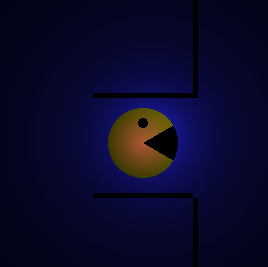
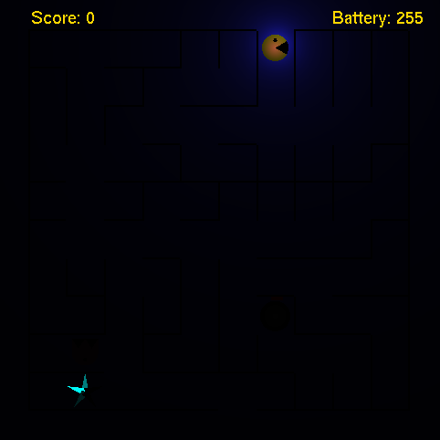
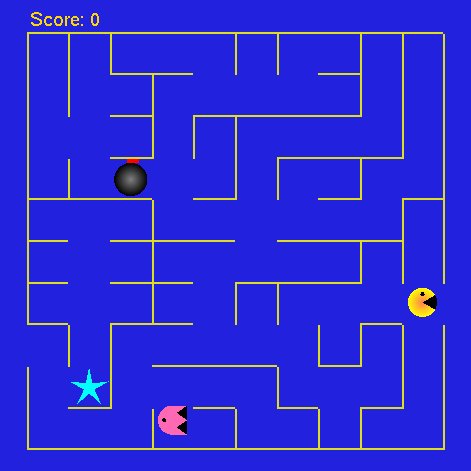
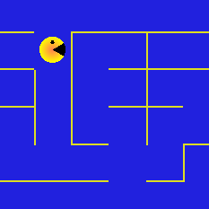
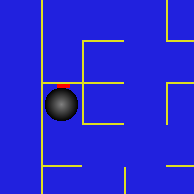
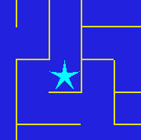
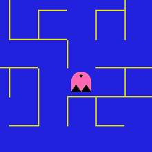
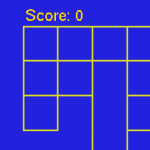
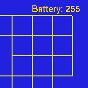

# Pacman


## Running the program

The program requires the installation of OpenGL and GLUT.

```bash
> git clone https://github.com/JyotiSunkara/Pacman.git
> cd Pacman
> make 
> ./pacman
```

## Controls

- `Space bar`

    Begin procedural generation of the maze.

- `W A S D` 

    Scroll the maze right, left, top and bottom.

- `Arrow keys`

    Move the character right, left, up and down when the maze allows it!

- `Page up`

    Zoom into Pacman's location, feature available in closed view only.

- `Page down`

    Zoom out of Pacman's location, feature available in closed view only.

- `Home key`  

    Over view the maze to see the enemy, bomb and star locations!

- `End key` 

    Closed view the maze, can view Pacman and its surroundings.

- `Delete key`

    Reset zoom and scroll back to default closed view.

## Features 

### Zooming
    Page Up and Page Down to zoom into pacmans surroundings. Availbale in closed view!

### Pacman Light Mode
    The light mode enables the viewer to see only the immediate surroundings of Pacaman. 
    Ambient light is disabled!



### Procedural Maze
    Unique maze each time the program is run!




### Pacman 
    Designed to look like Toru Iwatani's original!



### Bombs
    Cause a loss of 10 points when encountered!



### Stars
    Cause an increse of 10 points when encountered as well as an increase in battery power!




### Ghost
    Designed to look like Pinky from Toru Iwatani's original!




### Score
    Displayed in all modes!




### Battery
    Displayed in light mode!




## Special Features

### Blinking Pacman and Pinky

Paman and Pinky give you a wink every now and then!

### Rotating Pacman

Pacman rotates to take the path you have chosen for it when you press the arrow keys. This gives the user a better user experience while playing the game.

### Auto Mode

Pacman travels the maze all on his own in this mode! The enemy is disabled to allow pacman to freely find his way and show you how to get to the exit.

### Custom Maze Size

You can create a free size maze in this mode! The program will prompt for a maze with and haight in the range [5, 50] and then create the grid.
